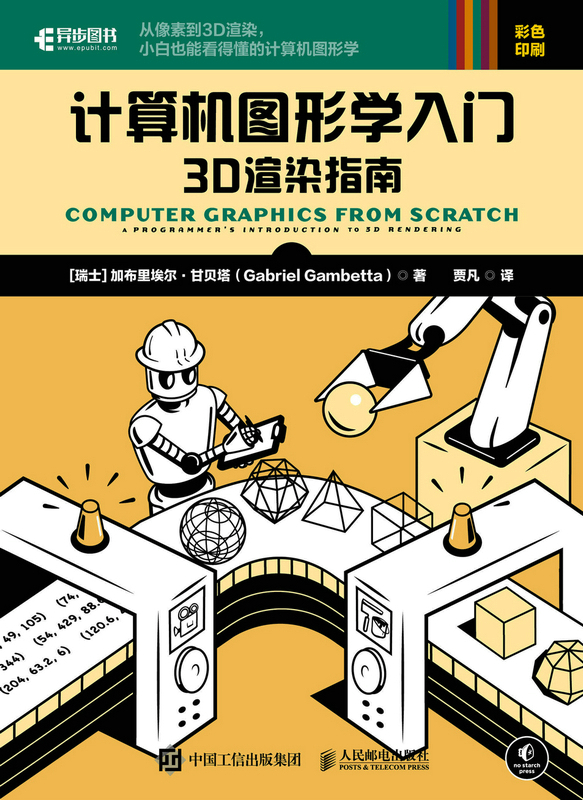
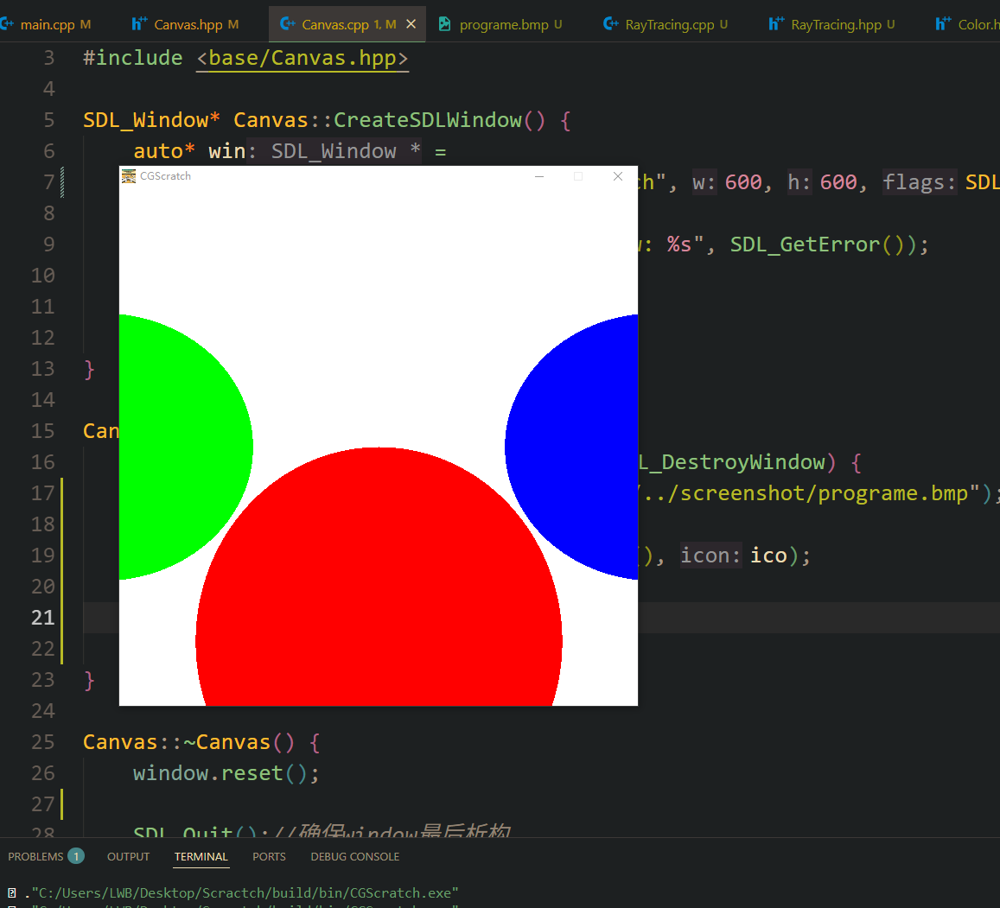

# 🎨 Computer Graphics from Scratch (C++ Achieve)  
### 《计算机图形学入门》3D渲染指南 - 基于SDL3的CPU实时渲染

<div align="center">
  
</div>

## ✨ 项目特性
- **教学友好**：循环窗口渲染


## 🔎 运行截图
* Chapter2
<div align="center">
  
</div>

## 🚀 快速开始
```bash
cmake -G "Unix Makefiles"

./build/bin